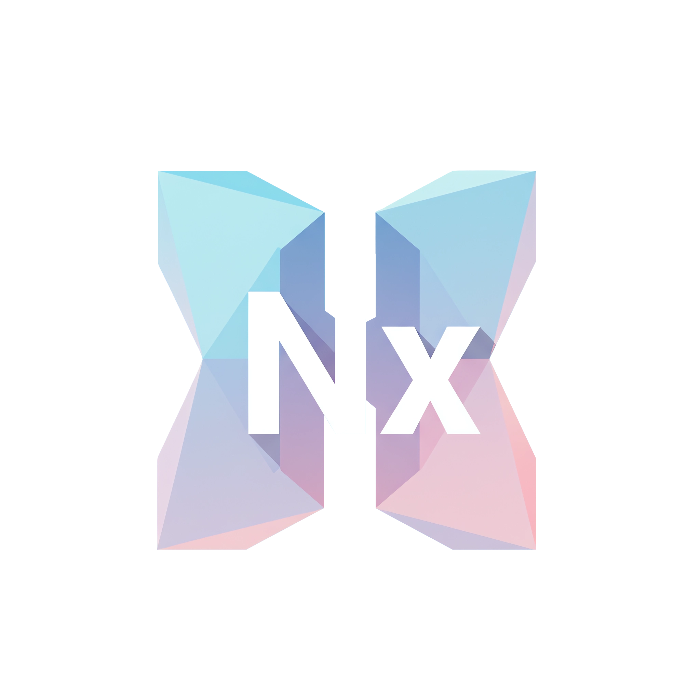

<div align="center">



# NxScript

**Powerful scripting languages for game development**

[](LICENSE)
[](https://haxe.org)
[](#-testing)

<!-- [🇪🇸 Leer en Español](README_ES.md) -->

---

### Two specialized languages, one seamless experience

</div>

## 🎯 Overview

**NxScript** provides two specialized scripting languages designed for game development:

- **💬 Nx-Dialogue** - Interactive dialogue and branching conversations
- **⚡ NxScript** - General-purpose bytecode scripting with VM execution

Both languages integrate seamlessly with Haxe projects and share a similar, easy-to-learn syntax.

---

## 💬 Nx-Dialogue System

A specialized language for writing branching dialogues, conversations, and narrative flows.

### ✨ Features

- 💭 **Natural Writing** - Write dialogue as plain text
- 🔀 **Branching Logic** - if/else, switch/case for dialogue flow
- 🎯 **Functions** - Reusable dialogue blocks
- 📞 **Custom Commands** - @commands for game integration
- 🔢 **Variables** - Track dialogue state and choices
- 🎲 **Operators** - Full arithmetic and logical expressions
- 🌐 **Word Operators** - Use `and`, `or`, `not` alongside symbols

### 📝 Quick Example

```
# NPC Greeting
var playerName = "Hero"
var questActive = false

func greetPlayer
    Welcome, brave adventurer!
    What brings you to our village?
end

func giveQuest
    We need your help with the bandits.
    Will you accept this quest?

    @showQuestUI "Defeat the Bandits"
    questActive = true
end

# Main conversation
@greetPlayer

NPC: So, what do you say?

if (playerLevel >= 5 and not questActive)
    @giveQuest
    NPC: Good luck on your journey!
else
    NPC: Come back when you're stronger.
end
```

### 🎮 Integration Example

```haxe
import nz.dialogue.Dialogue;

class DialogueManager {
    var dialogue:Dialogue;

    public function new() {
        dialogue = new Dialogue();
    }

    public function loadScript(path:String) {
        var script = sys.io.File.getContent(path);
        dialogue.load(script);
    }

    public function update() {
        if (dialogue.hasNext()) {
            var result = dialogue.next();

            switch (result) {
                case Dialog(text):
                    showDialogueBox(text);

                case AtCall(command, args):
                    handleCommand(command, args);

                case Variable(name, value):
                    trace('$name = $value');
            }
        }
    }
}
```

### 📚 [Full Dialogue Documentation →](src/nz/dialogue/README.md)

---

## ⚡ Nx-Script Language

A powerful general-purpose scripting language with bytecode compilation and stack-based VM.

### ✨ Features

- 🔢 **Bytecode Compilation** - Fast execution with stack-based VM
- 📦 **Modern Syntax** - Clean and intuitive language design
- 🔤 **Variable Types** - `var`, `let`, `const` for different scopes
- ⚙️ **Functions** - First-class functions with closures
- 🧬 **Method Chaining** - Call methods on primitives: `(-5).abs().floor()`
- 📊 **Data Structures** - Arrays and Dictionaries built-in
- 🔄 **Control Flow** - if/else, while, for loops
- ♻️ **Recursion** - Full recursive function support
- 🎯 **30+ Built-in Functions** - Math, strings, arrays, type conversion
- 🐛 **Debug Info** - Line/column tracking for errors

### 📝 Quick Example

```nzs
# Variables
var health = 100
const MAX_HEALTH = 100

# Functions
func heal(amount) {
    health = health + amount
    if (health > MAX_HEALTH) {
        health = MAX_HEALTH
    }
    return health
}

# Method chaining on primitives
var damage = (-50).abs().floor()
var name = "  warrior  ".trim().upper()

# Built-in functions
trace("Health:", health)
print("Damage:", damage)

# Arrays with methods
var inventory = [1, 2, 3]
inventory.push(4)
trace("First item:", inventory.first())
trace("Length:", inventory.length)

# Iteration
for (item in inventory) {
    print("Item:", item)
}

# Recursion
func fibonacci(n) {
    if (n <= 1) {
        return n
    }
    return fibonacci(n - 1) + fibonacci(n - 2)
}

trace("Fib(10):", fibonacci(10))
```

### 🎮 Integration Example

```haxe
import nz.script.Interpreter;

class GameScript {
    var interp:Interpreter;

    public function new() {
        interp = new Interpreter();
    }

    public function runScript(path:String) {
        var source = sys.io.File.getContent(path);
        interp.run(source, path);
    }

    // Easy value access with automatic conversion
    public function getValue(name:String):Dynamic {
        return interp.runDynamic('$name');
    }

    // Set values from Haxe
    public function setValue(name:String, value:Dynamic) {
        interp.setVar(name, value);
    }

    // Call script functions
    public function callFunction(name:String, args:Array<Dynamic>) {
        var argStr = args.join(", ");
        return interp.runDynamic('$name($argStr)');
    }
}
```

### 🧬 Method Chaining

Nz-Script supports calling methods directly on primitive values:

```nzs
# Numbers
var x = (-2000 / 2).abs().floor()  // 1000

# Strings
var text = "  HELLO  ".trim().lower()  // "hello"

# Arrays
var arr = [1, 2, 3]
var last = arr.last()  // 3
```

### 📚 [Full Script Documentation →](src/nz/script/README.md)

---

## 📦 Installation

### Via Haxelib (Recommended)

```bash
haxelib git nxscript https://github.com/senioritaelizabeth/NxScript.git
```

### In your project's `.hxml`

```hxml
-lib nxscript
-main YourMainClass
-neko output.n
```

### or in case you use `lime`

```xml
<haxelib name="nxscript"/>
```

---

## 🧪 Testing

The project includes comprehensive test suites for both systems.

### Run All Tests

```bash
# Dialogue tests
cd test/tests
haxe basic.hxml
haxe methods.hxml
haxe classes.hxml

# Script tests
haxe test.hxml
```

### Performance Benchmarks

```bash
haxe speed_test.hxml
```

**Test Coverage:**

- ✅ 3 Dialogue test suites
- ✅ 3 Script test suites (Basic, Methods, Classes)
- ✅ 7 Performance benchmarks

---

## 📊 Performance

Benchmark results on typical hardware (Neko target):

| Benchmark                | Operations/sec |
| ------------------------ | -------------- |
| Arithmetic               | ~80K ops/sec   |
| Array Operations         | ~64K ops/sec   |
| String Operations        | ~59K ops/sec   |
| Method Chaining          | ~49K ops/sec   |
| Class Instantiation      | ~44K ops/sec   |
| Function Calls           | ~1K ops/sec    |
| Fibonacci(100) Iterative | ~0.4K ops/sec  |

_Run `haxe speed_test.hxml` for your system's results._

---

## 📖 Examples

### Dialogue Example

```bash
cd examples
haxe -cp ../src -main DialogueExample -neko dialogue.n
neko dialogue.n
```

### Script Examples

```bash
cd examples
haxe -cp ../src -main BuiltinFunctionsExample -neko builtins.n
neko builtins.n

haxe -cp ../src -main MethodChainingExample -neko chaining.n
neko chaining.n
```

Check the `examples/` directory for:

- ✨ Built-in functions showcase
- 🔗 Method chaining examples
- 🏗️ Class usage examples
- 💬 Dialogue system examples

---

## 🎬 Additional Systems

### Nz-Cinematic _(Experimental)_

Basic cinematic sequence support for cutscenes and camera control.

[View Cinematic Documentation →](src/nz/cinematic/README.md)

---

## 📁 Project Structure

```
NxScript/
├── src/nz/
│   ├── dialogue/        # Dialogue system
│   │   ├── Dialogue.hx
│   │   ├── executor/
│   │   ├── parser/
│   │   └── tokenizer/
│   │
│   ├── script/          # Script language
│   │   ├── Interpreter.hx
│   │   ├── VM.hx
│   │   ├── Compiler.hx
│   │   ├── Parser.hx
│   │   ├── Tokenizer.hx
│   │   ├── Bytecode.hx
│   │   └── Token.hx
│   │
│   └── cinematic/       # Cinematic system
│
├── test/
│   └── tests/          # Test suites
│       ├── BasicTest.hx
│       ├── MethodsTest.hx
│       └── ClassesTest.hx
│
├── examples/           # Usage examples
│   ├── BuiltinFunctionsExample.hx
│   ├── MethodChainingExample.hx
│   └── ClassExample.hx
│
├── SpeedTest.hx       # Performance benchmarks
└── README.md
```

---

## 🎯 Use Cases

### Perfect For:

| Nx-Dialogue            | Nx-Script                   |
| ---------------------- | --------------------------- |
| 💬 RPG conversations   | 🎮 Game logic and mechanics |
| 📖 Interactive fiction | 🔧 Mod support              |
| 🎭 Visual novels       | 🎲 Procedural generation    |
| 🗺️ Quest systems       | 🤖 AI behavior              |
| 📋 Tutorial sequences  | ⚙️ Configuration with logic |
| 🎬 Story-driven games  | 📚 Educational programming  |

---

## 🛠️ Built-in Functions (Nx-Script)

### Console Output

`trace(...args)` • `print(...args)` • `println(...args)`

### Type Utilities

`typeof(value)` • `int(value)` • `float(value)` • `str(value)` • `bool(value)`

### Math Functions

`abs(n)` • `floor(n)` • `ceil(n)` • `round(n)` • `sqrt(n)` • `pow(base, exp)`  
`sin(n)` • `cos(n)` • `tan(n)` • `min(a, b)` • `max(a, b)` • `random()`

### String Functions

`upper(s)` • `lower(s)` • `trim(s)`

### Array Functions

`len(arr)` • `push(arr, item)` • `pop(arr)`

### Constants

`PI` • `E` • `NaN` • `Infinity`

[View complete API documentation →](docs/BUILTIN_FUNCTIONS.md)

---

## 🤝 Contributing

Contributions are welcome! Here's how:

1. 🐛 Report bugs via [Issues](https://github.com/senioritaelizabeth/NxScript/issues)
2. ✨ Propose features
3. 📝 Improve documentation
4. � Add tests
5. 💻 Submit pull requests

### Development Setup

```bash
# Clone repository
git clone https://github.com/senioritaelizabeth/NxSciprt.git
cd NxScript

# Run tests
haxe test.hxml

# Run benchmarks
haxe speed_test.hxml
```

---

## 📄 License

**Apache 2.0 License** - Free to use in any project, commercial or otherwise.

---

## 🙏 Acknowledgments

Created with ❤️ by [@senioritaelizabeth](https://github.com/senioritaelizabeth)

Built for the Haxe game development community.

---

## 🔗 Resources

<!-- - 📚 [Dialogue Documentation](src/nz/dialogue/README.md) -->
<!-- - 📚 [Script Documentation](src/nz/script/README.md) -->
<!-- - 📚 [Built-in Functions Guide](docs/BUILTIN_FUNCTIONS.md) -->

- 🐛 [Issue Tracker](https://github.com/senioritaelizabeth/NxScript/issues)
- 💬 [Discussions](https://github.com/senioritaelizabeth/NxScript/discussions)

---

<div align="center">

**Made with ❤️ for game developers and interactive storytellers**

[⭐ Star on GitHub](https://github.com/senioritaelizabeth/NxScript) • [📖 Read the Docs](src/nz/README.md) • [🐛 Report Bug](https://github.com/senioritaelizabeth/NxScript/issues)

</div>
